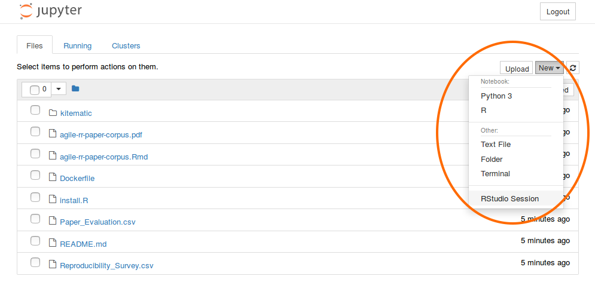
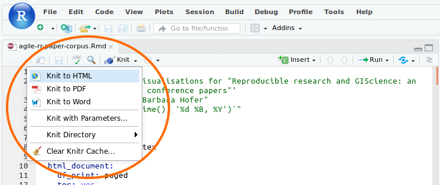

# Reproducible research and GIScience: Computational Environment

Ready to use R Markdown notebook for the paper "Reproducible research and GIScience: an evaluation using AGILE conference papers".

[https://peerj.com/preprints/26561v1/](https://peerj.com/preprints/26561v1/)

## Reproduce Online

Click the "Binder" button below to open the notebook on [binder.org](https://mybinder.org/).

On the Jupyter page that opens, select "New > RStudio".

In RStudio, select "Knit > Knit to PDF" to render the document. You may use other output formats, like HTML, but not that the tables are bespoke for PDF output.

For the analysis to complete you have to complete two crucial steps:

- Add a Springer API key
- Add data to workspace

## Files in this repository

- `Paper_Evaluation.csv`: Results of manual paper evaluation.
- `Reproducibility_Survey.csv`: Anonymised responses of author survey.
- `agile-rr-paper-corpus.Rmd`: R Markdown document with the code to conduct the analysis and create the figures of the paper.
- `agile-rr-paper-corpus.pdf`: A PDF rendering or he analysis document for viewing.
- `Dockerfile`: A recipe for the computational environment using [Docker](https://en.wikipedia.org/wiki/Docker_(software)).
- `install.R`: R script file executed during creation of the Docker image to install required dependencies.

## License

The documents in this repository are licensed under a [Creative Commons Attribution 4.0 International License](https://creativecommons.org/licenses/by/4.0/).

All contained code is licensed under the [Apache License 2.0](https://choosealicense.com/licenses/apache-2.0/).

The data used is licensed under a [Open Data Commons Attribution License](https://opendatacommons.org/licenses/by/).
